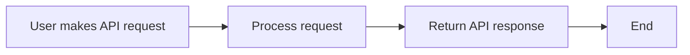

  posts soon(tm)  
 ---
 >holy moly it works, im probably spouting nonsense during sections of this feel free to email me to correct it
 
Finally I have an actual blog system to post to, later on if I have time ill bring over the couple blog posts I made ages ago when the site wasn't exactly structured well. I plan for this to be like a one stop place to view all my work! Of course the actual content will be distributed on different platforms first but ill bring it all together here. Hopefully ill get around to updating this pretty often since there were issues trying to get it to work 
(CORS RAHHHHH)

NotMyMacro
---
Undercity is this year's summer hackathon by Github/Hackclub! I had to make a macropad with strict requirements to get in. I chose to create a macro pad to get in since it provided the amount required to get into undercity so that was a pretty cool experience learning KiCAD and Fusion360 (the default configuration is so bad i can't even). Ill do an update post afterwards!

Some things that a friend of mine noticed though concerning HackClub is that it's pretty insecure, some of their API endpoints were open to anybody with a questionable amount of information available upon request. It's mostly alright now since they patched some of the security infrastructure, but im still a bit wary of their security since the participants of this program dont know if parts of their infra were vibe coded

> *"Vibe coding" is the practice of using AI to complete or aid in tasks in programming. Often times the code is insecure or creates more errors than it solves. There is also the ethical question of what the AI models train their data on.*

During Github's summer of code, several API calls are made available through different parts of the program to allow users to integrate their programs easier and get ideas out quicker. Now normally when you create an API that has at least some data that should be hidden, the usual flow of use will look something like this:

Now for Hack Club/Github's summer of code, some of the API endpoint calls had a flow use that looked like this:

This is definitely a big issue when theres possibly personally identifiable information at the endpoint. The major issues have been patched by their team but I do think it's incredibly important to actually pentest the endpoint before shoving it in production. 

NOW ON TO THE ACTUAL PROJECT  PART

NotMyMacro is a 15 key macro pad that i made in Fusion 360 and KiCAD

> [Top] Fusion Render, [Bottom] KiCad mainboard screenshot. Overall the project turned out pretty nice! 

I had a lot of trouble getting the Geometry right for this but it all paid off. I used the RP2040 as the base as its easy to get started with, KiCAD is another program that's easy to get started with and loved using while making this.

MacOS Tahoe before MacOS Tahoe
---
>holy moly this system is actually really usable in 2025

Windows 7 surprisingly still works with most modern programs, I shouldn't be too surprised since it only lost support 5 years ago but still. Its what I used to make this post and create the website!

>currently using a thinkpad l540 with an i5 4300mq and 16GB of ddr4

I still use Windows 7 even when its out of support for a couple reasons, one of them being that i'm using hardware which technically yeah can run Windows 10/11 but doesn't exactly run those operating systems too well due to mr gates stuffing copilot down my throat, unlike 7 which my computer can run mid range productivity suites on :D

(It also generally has less background processes, and yes before somebody says something I am dual booting this with Arch Linux on Linux-LTS kernel.)
Ill try to actually post on this thing lol.
